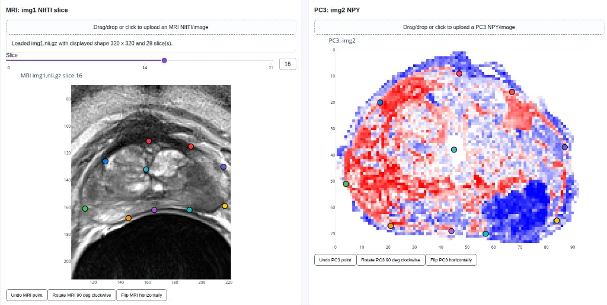
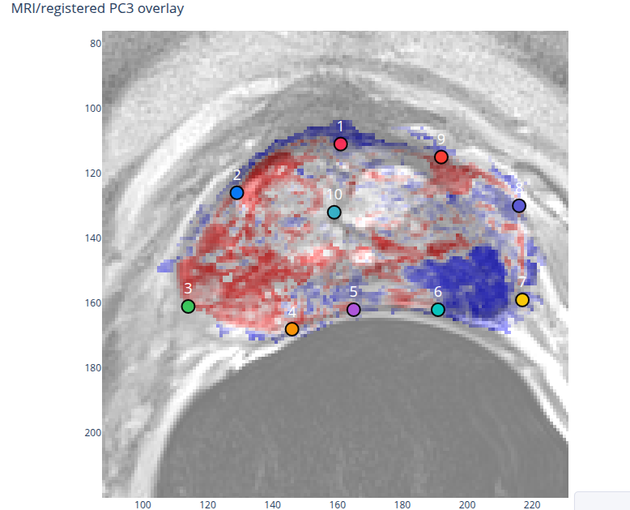

# Semi-Automatic Non-Rigid Registration

This Dash app registers PC3 data from `img2.npy` into the pixel space of a selected MRI slice from `img1.nii.gz` using landmarks selected by the user.

If `img1.nii.gz` is not present, the app falls back to `img1.png` so the interface can still be tested. If `img2.npy` is not present, it falls back to `img2.png`, then to a placeholder image.

## Run

```bash
UV_PROJECT_ENVIRONMENT=/home/olmozavala/uv/envs/eoasweb uv run python app.py
```

Then open the local Dash URL shown in the terminal.

## Interface Example

Landmarks are selected in matching order on the MRI slice and PC3 image.



After registration, the overlay helps visually inspect how the warped PC3 image aligns with the MRI slice.



## Inputs

- MRI: `img1.nii.gz`, displayed as a grayscale slice stack.
- PC3: `img2.npy`, treated as single-band scalar data.
- PC3 `NaN` values are displayed as white.
- Finite PC3 values are displayed with a Matplotlib-like `bwr` palette: blue for low values, white near the middle, and red for high values.

## Workflow

1. Select the desired MRI slice with the slice slider.
2. Rotate or horizontally flip either MRI or PC3 if its orientation needs adjustment.
3. Click matching landmarks in the same order on the selected MRI slice and PC3 image.
4. Use the undo buttons if a point is misplaced.
5. Select at least three matching point pairs.
6. Click **Run registration**.
7. Click **Save registered PC3 2D NIfTI** to write a spatially referenced `.nii.gz` file in `registered_outputs/`.

## Registration Method

The app uses landmark-based non-rigid registration. Each point selected on the MRI slice is paired with the point selected in the same order on PC3.

After at least three point pairs are selected, the app fits a thin-plate-spline radial basis function transform. The transform is built as an inverse mapping: for every pixel in the output MRI slice, it estimates the corresponding source coordinate in the PC3 image. Raw scalar PC3 values are then resampled at those coordinates using linear interpolation.

The optional edge stabilization adds corresponding image-corner landmarks. This reduces unstable extrapolation near the borders when only a few interior landmarks are selected.

## Output

The registered PC3 result has the same pixel height and width as the selected MRI slice. For display, the registered scalar PC3 image is shown with the same `bwr` palette and white `NaN` background.

When saving, the app writes a 2D NIfTI file. The saved image keeps the selected MRI slice's world-coordinate location by using the MRI affine shifted to that slice. This means the registered 2D PC3 output remains spatially referenced to the original MRI coordinate system.
